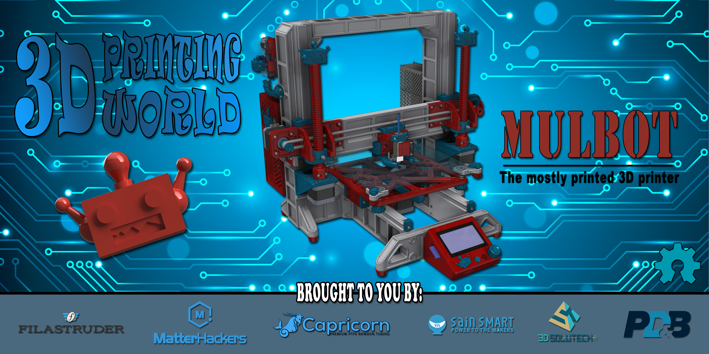

The Mulbot is a open source mostly printed printer.

You can find more information at:

Thiniverse: https://www.thingiverse.com/thing:3432384

Facebook User Group: https://www.facebook.com/groups/275718849985834/

Reprap: https://reprap.org/wiki/Mulbot

The Mulbot is a open source mostly printed printer that I designed to bring to show the people at MRRF 2019! 

I had a table for a few hours at MRRF last year and I brought these 3D printed bearings I designed that use recirculating bearing balls and naturally everyone was suggesting that I make a printer with them. By the time I was in the car driving home I already had some ideas in my head and a plan to bring the printer to MRRF the following year!

I figured since the bearings where 3D printed I would print some other parts as well. For example the X-axis uses a 3D printed double wide TPU timing belt and printed drive and Idle pulleys. The Y-axis uses a printed rack and pinion to traverse the bed. The Z-axis is driven by two oversized printed trapezoidal nuts and screws.

Project Goals

MRRF
The main goal for this project was to bring a mostly printed printer that uses the bearings I designed to MRRF 2019!  

The original intent for this project was not to design a printer that others could make. I designed it because I thought it would be fun and that others would like to see it as well! Having said that, I think it’s awesome that so many others want to build it and I will gladly share may ideas with hopes that together as a community we can continue to improve upon the concept.  

The print quality and feasibility of the printer has by far exceed my expectations and I could  not be happy with the way it turned out. I hope this project will push the RepRap concept and perhaps give others ideas on how to make it better. 

Cost Effective? 
My goal was not to make the most cost-effective printer but a mostly printed printer. If you are looking for a really cheap second printer to run production parts, then this printer is probably not the right fit for you.  You can purchase a clone kit cheaper than you can make this printer, as it’s not a goal for this project. Having said that, if you have some filament laying around and some miscellaneous parts, you can make this printer pretty cheaply. 

Self-replicating
As designed the Mulbot is not self-replicating, it was not a goal of mine when I started the project so I did not design for it.  The build volume that is required to print the largest frame members is larger than the printer can print so at this point it’s not self-replicating.  Not to say that it can’t be achieved with some design tweaks.  Honestly, I don’t see the point until a mostly printed printer can perform equally to a manufactured printer. Maybe if we continue to openly share and revise our ideas together as we can make it better! 

Specifications:
Prints PLA and TPU
8-1/2” Square Floating Glass Bed
Print size 
175mm x 200mm x 150mm (dual fan shroud)
145mm x 200mm x 150mm (surround shroud)

Where to Start

Before you undertake this project you may want to consider making one of my other smaller projects first. I would say that printing the Mulbot is no more difficult than any of my other projects, there are just more parts. If you had luck with my other designs you will probably not have an issue the Mulbot. 

Here are some examples that you might want to consider; [Linear bearing][lb], [Stepper slide][ss], [Jack screw][js], [Grippers][grip], [Secret Box][sb]. 

[lb]: https://www.thingiverse.com/thing:2847294
[ss]: https://www.thingiverse.com/thing:2967644
[js]: https://www.thingiverse.com/thing:2219156
[sb]: https://www.thingiverse.com/thing:2977908
[grip]: https://www.thingiverse.com/thing:2204113

Printing  Requirements
Required Print Volume: 250mm x 210mm x 210mm
To print the largest pieces you will need a build volume equal to my Original Prusa MK3. 

Flat Print Surface
I printed all the parts on the Prusa MK3 stock cast aluminum bed with PEI flex plate but it is not perfectly flat.  If I had the choice I would have preferred to print on a glass bed as it would be much flatter. Having said that, because of the way the frame is design I don’t think bed flatness will be a big deal. 

Filament Selection
Everything but the belt and the mounting feet were printed out of PLA, those were printed out of TPU.  I chose PLA because I think it’s the best option as its very stable and doesn’t shrink or warp. I also thought making the printer out of PLA would make it much easier for the vast majority of people to make. 

Note: I did have some softening of the gear pinion and the drive pulley as a result of the heat from the stepper motors so I did end up printing those out of ABS but PETG would probably work as well. 

Test a Bearing First
Before starting to print anything else, I would first print a y-axis bearing rail and bearing. If you can’t get the bearings to work then this will save you from printing the rest of the printer for no reason. The x-axis bearing is the smallest and requires the least amount of filament to print, so I would start there. The bearings need to be the exact otherwise the balls will not recirculate properly. To little preload and the bearing will be to sloppy, too much preload and the balls wont recirculate. See “Bearing Fit” section for more information.

Order the parts
I tried to use suppliers and components that were readily available wherever possible but some components will be better sourced directly from overseas to save money. The biggest case would be for fasteners and hardware. I would start this project by ordering the fasteners and bearing balls needed to build and test at least one bearing so it can be proven and you can move on to printing and building the rest of the machine. 

Filament: 

I used Solutech for all the PLA printed parts. Below is a list of the filament necessary for the color scheme I chose. 

*   1 x [Spool Real Red][RED]
*   2 x [Spool Real White][WHITE]
*   1 x [Spool Real Blue][BLUE]

It takes less then 2kg of filament in total to print the entire printer.

[red]: https://amzn.to/2DqQd2m 
[white]: https://amzn.to/2OreAxD 
[blue]: https://amzn.to/2SPxTEl 

TPU

Sainsmart
*   1 x [Red][RED]
*   2 x [White][WHITE]

Both materials also print great on the non-heated glass bed with a little glue stick.

[white]: https://amzn.to/2QwaF4o 
 [red]: https://amzn.to/2PGZWHo 

Components: 
I designed the printer to use as cost effective components as possible to reduce the cost of the build but to also use some open source components that are reliable and more gooder.  You should be able to build this printer with the components specified in the bom for about $250-300. The cost for fasteners and hardware adds up quick, if you already have some of this stuff in stock you can save some money. 

I have highlighted some of the components below as well as publish a full bom.

Bowden Tubing
*   [Capricorn XC 1.75  Bowden Tubing][cap] 
Since I’ll be printing TPU I went with the original Capricorn XS version with the reduced ID as it will leave less room for the flexible filament to bend. 
[cap]: https://www.captubes.com/shop/#!/1-Meter-XS-Low-Friction-1-75mm-Bowden-Tubing/p/82190682/category=23214267

Hotend
*   [Genuine E3D Lite6 Hot End][hot] 
I thought the Lite6 was a perfect fit for this printer because of its reliability’s and low price tag, around $30. Sure you can order a clone; wait five weeks, maybe save a few bucks, but the loss of quality is just not worth it in my option. Plus I like to support Opensource company’s like E3D because the clones wouldn’t existed without them. You want the 1.75mm Bowden type and the 12v version if your running ramps. 

[hot] https://www.filastruder.com/products/lite6?variant=1227433316

1.75 Bowden Extruder
*   [SeeMeCNC EZR][ezr]

Since the printer doesn’t have a heated bed I thought it would be good to have an extruder that can print both PLA and TPU.  Both materials will print perfectly well with a non-heated glass bed with a little glue stick. The extruder is great at PLA but also at TPU as the filament is better guided through the extruder. What I think makes this extruder most unique is that the pressure roller moves lineally instead of radially on an arm so the pressure stays perpendicular to the path of the filament. You would think that this  would help with flex but at the very least it’s a cool design. 

The other thing that is cool is since SeeMeCNC is an open source company I was able to down load the actually 3D models of the extruder from their GitHub page! This made life so easy when it came to design for the extruder. The other thing is its only $35 which is almost half other extruders on the market which makes it perfect for this printer. You don’t even have to worry about it causing you inconsistent extrusion. :) Additionally SeeMeCNC is also a major sponsor at MRRF, which is a plus.

[ezr}: https://www.matterhackers.com/store/l/seemecnc-ezrstruder-kit/sk/MWHJ83XV?aff=7457

Fasteners

See the BOM for a full list of fasteners

Hex Nuts
*    70 X M3 x 0.5 
*    10 X M4 x 0.7 
I also used square nuts where applicable 

Button Head Cap Screws
*    4 X M3 x 0.5 x 6MM LG. 

Flat Head Cap Screws
*    4 X M3x0.5 x 50MM LG. 

Socket Head Set Screws
*    2 X M3x0.5 x 5MM LG. 
*    4 X M3X0.5 X 12MM LG. 

Socket Head Cap Screw
*    15 X M3x0.5 x 6MM LG. 
*    9 X M3x0.5 x 8MM LG. 
*    46 X M3x0.5 x 10MM LG. 
*    40 X M3x0.5 x 16MM LG. 
*    13 X M3x0.5 x 20M LG. 
*    2 X M3x0.5 x 35MM LG. 
*    7 X M4x0.7 x 10MM LG. 
*    1 X M4x0.7 x 12MM LG. 
*    26 X M4x0.7 x 20MM LG.

Hardware
Bed Springs
*    Aliexpress:  4  X [7.5MM OD X 20M LG X 1.2MM Wire Compression Spring][spring]

Bearing Balls
*    Ebay: 572 X  [GRADE 100 4.5MM S.S. Bearing Balls][balls]
Must  be Grade 100 bearing balls. BB's or shot will not work!

*    Build Surface: Glass 8.5” x 8.5” x .12”d

[spring]: https://www.aliexpress.com/item/10pcs-Leveling-Spring-Accessories-for-3D-Printer-Extruder-Heated-Bed-Ultimaker-Makerbot/32880868017.html?spm=a2g0s.9042311.0.0.27424c4d14HhSG
[balls]: https://www.ebay.com/itm/300-pcs-4-5mm-0-1772-Inch-SS316-Stainless-Steel-Bearing-Ball-316-G100/301149470266?hash=item461de83e3a:g:sloAAOxyeZNTRmUV:rk:2:pf:0

Thread Inserts
You will need a soldering iron for inserting the heat-set inserts.  You can use a standard soldering tip but the custom tip linked below is much better at inserting the nut straight.  It’s also nice to have a soldering iron with adjustable temperature so you can turn it down really low. If it’s too hot PLA will get to soft very quickly which could ruin the hole. I install my inserts at 350F, which gives a little time for the nut to heat up and sink in. 

*   [M3 Tread Inserts][m3]
*   [M4 Tread Inserts][m4]
*   [Heat-Set Install Tip][tip]

[m3]: https://amzn.to/2Fm3Way
[m4]: https://amzn.to/2Xj3ikD
[tip]: https://amzn.to/2FlXl01

Control System

I chose a ramps 1.4 controller as it’s the cheapest, most available controller.

*   Sainsmart: [Ramps 1.4 & Mega Controller][sain] 
I went with DRV8825 drivers because I read that they run cooler but A4988’s would work as well. 
[sain]: http://shrsl.com/1be01

*   Amazon: [Rep Rap Discount Full Graphic Smart Display][dis] 
 [dis]: https://amzn.to/2GttCn7

*   Amazon: [Limit Switch][ls] 
Make sure you don’t wire these backwards.  If you do you will blow the 5v on our mega because of the led, I learned the hard way…
[ls]: https://amzn.to/2Gw5iB8

*   Amazon:[Nema 17 Stepper Motors][step]  
I just went with the cheapest motors I could find. 
[step]: https://amzn.to/2BJ3LUd

*   Amazon:[5015 Blower Fan, 12v][fan]  
[fan]: https://amzn.to/2EIfZyn

You will also need a 90 USB A Male to B Male cable for connecting to the Arduino. 

LED’s
*   Amazon: [5630 12v LED Strip Lights][led] 
I designed for two 5630 12v LED strip lights with adhesive backing. There is a spot for two strips which allow you space to run the wiring into the frame. One strip gets installed on the x-axis rail and one on the top crossmember. I powered the led’s on the x-axis rail from the ramps board and ran the led on the top crossmember directly to the power supply. This way both led’s turn on when the power supply is switched on. 
[led]: https://amzn.to/2TiFu1u

Power Supply
*   Amazon: [150W 12V Power Supply][ps]
Since there is not a headed bed you can get away with a smaller power supply, this one is really cheap.  If you want the ability to update to a heated bed you will need a larger power supply.  If you go with this power supply though the mounting holes and the cover will all match up. 
[ps]: https://amzn.to/2Erzmf1

Inlet Plug 5A with Switch
*   Amazon: [IEC320][plug]
[plug]: https://amzn.to/2XvJn1Y

Printing

Orientation & Supports
The parts should be in the correct scale and orientation when you bring them into your slicer. None of the parts require supports with the exception of the y-axis servo mount which needs some supports for the slotted holes for the stepper motor. 

Material’s
I printed all the parts out of PLA with the exception of the timing belt, which is TPU.  After running it for a while I noticed that the screws would loosen up on the pinion and the drive pulley as a result of heat from the steppers.  I ended up printing those in ABS, but PETG would probably be a good choice as well. If you are printing them out of ABS you will have to scale it up slightly to account for shrinkage. 

Lifting
I also had issues with some of the large frame members lifting off the bed.  I normally don’t have this issue but it’s because the parts are so narrow and tall it’s hard to keep them on the bed even with a brim. As a result I used very large helper discs on the ends of the frames to keep them down while printing which did the trick.

Shells and Infill
I printed the entire printer with less than 2 kg of filament! Pretty much all the parts were printed with only 2 shells and 15% infill with the exception of the screws.  The screws were printed with four shells and 25% infill to make them more ridged. If you are wondering why they are hollow it’s because it makes them much stiffer. 

Since this was my first time printing it I did not want to waste a lot of filament in case I needed to make revisions so I did not make the parts really strong.  However, all the parts seem plenty strong with these settings. If you wanted to make it stronger you could try 3-4 shells with 20-25% infill but I feel any more than that would be overkill. 

Bearing Assembly
Bearing Preload
Hopefully everyone’s bearings will have just the right amount of preload, but not everyone’s printer will be the same so this probably is not going to happen... I would say the relationship between the rails and the bearing need to be within +/- .005” to function properly. If your preload is not right you can try scaling the Y axis(as the model comes in your slicer) slightly to compensate. I would try scaling it up or down roughly .7% which would equate to .005”.  

Bearing Balls
The bearing are designed to utilize Grade 100 4.5mm S.S. bearing balls, it will not work with standard BB’s.  Bearing balls are more expensive then BB’s but they are also much more accurate and result in a smoother running bearing. I think BB’s would have worked but I thought a smoother bearing was worth the extra $10. Each bearing takes 112 bearing balls.

He is a quick video showing the assembly of the original bearings.
Bearing assembly video https://youtu.be/cF8fXATjccQ

Cleanup and Deburr
Burrs and unsmooth print surfaces will affect your bearings performance.  I have noticed that the bearings run a little rough at first but get smother as they break in.  I believe this is a result of the endcaps not being smoothed and/or having burrs.  Make sure the balls can freely flow thru each return track and end cap by manually dropping a single bearing in each hole. After the bearings have been broken in I have not noticed any issues with wearing. 

Preload
The bearing preload is not as crucial on the Y and Z axis as it is on the X axis.  The Y and Z axis both have two bearings instead of one and they hardly have any overhung load so they can get away with more slop. The hot end is overhung on the X axis bearing, plus there is only one bearing, so you will need a good amount of preload to remove the slop and have the extruder held properly. 

Y-Axis and Bed Assembly
I would start the assembly by first putting the bearings on both y-axis rails. Then build the rest of the y-axis frame assembly but only finger tighten the screws.  After the frame is assembled mount the bed frame on the bearings but don’t install the stepper motor yet.  Place the frame on a flat surface and tighten all the screws as you move the bed back and forth. Last install the servo motor and drive pinion.  Use the slotted holes and set screws to remove the clearance between the gear rack and pinion.

Credit to [Komb]{komb} for the rack and Pinion
[knob]: https://www.thingiverse.com/thing:173516

X and Z-Axis Frame Assembly
Mount the two Z-axis bearing and the X-axis bearing to their corresponding bearing rail. Attach the Z-Axis frame components to the Y-axis frame that was just assembled.  Connect the X-axis frame rail to the two Z-axis bearings and move the Z-axis up/down and tighten all the mounting screws.  Lastly add the drive components for both the X and Z axis. 

The X-axis idle pulley uses the same 4.5mm bearing balls that the linear bearings use.

Cooling Nozzle
Choosing a Part Cooling Nozzle

There are two options when choosing a hot end and part cooling fan. One option is to use a 40mm dual fan shroud like the one that [eiPionezero][fan] made that mounts directly to the lite6 heatsink. The other option is to use the fan that comes with the hotend along with a separate 5015 blower and surround shroud for better part cooling.  

The surround shroud cools really well but the down side is that it reduces the build volume as the shroud will run into the bed clips as they are above the glass. See “specifications” for more information.  As a result I made a spacer that attaches to the x-axis switch arm that reduces the travel when using the surround nozzle. 

[fan]: https://www.thingiverse.com/thing:839620

Controller & Firmware
I am running [Marlin][mar] on the ramps board which I really like and was a lot of fun to configure! I have not posted my configuration files as I am not a expert at setting them up but if it will help some people out I would be happy to do so, just let me know. 

I did configure for “EFF”, since I do not have a heated bed.  This way you can use D8 to control your hotend fan so that it automatically turns on/off.  Just remember to supply voltage to both 5a and 11a input terminals. 

[mar]:http://marlinfw.org/

VREF
I adjusted the Vref Voltage on each of my DRV8825 drivers and it really helped to reduce the heat of the steppers. I was able to adjust the voltage down quite a bit and still not have any missed steps.  I think it’s a result that everything is so light since it’s all made of plastic. 

Maintenance
Lubrication 
I have not lubricated any of the printed components because I did not want the mess but I would imagine that it would greatly increase the life cycle of the components.  I would recommend using [PTFE Supper Lube][lube] on the rack, pinion, and the screws. I designed for grease zerks in the Z-axis nuts but I have not used them yet. I installed the press fit grease zerk using a soldering iron like a heat-sink thread insert. 

I have not tried lubrication on the recirculating bearings yet.  I did try some PTFE spray on the single row version and it caused the ball to not recirculate properly so I have not experimented with it since. 

[lube]: https://amzn.to/2Tc7VPi

Printed Belt
The TPU printed belt works surprisingly well.  Since there is no tension members it will stretch but my calibration cube was still pretty accurate. I did notice that if I left the belt under tension for a while it has some memory and it causes a hump in the belt where its being bent around the pulleys.  After running it a while the hump will work itself out, but as a result when I’m not using it I try to release the tension so I don’t have this issue. 

Resources
*   [Prusa Step Calculator][cal]
Use this to calculate the steps per axis.  The default steps in marlin were actually a good starting point, I just adjusted from there. 
*   [Marlin][mar]
Firmware

[cal]: https://www.prusaprinters.org/calculator/
[mar]: http://marlinfw.org/

Closing and Moving Forward
This was a really great project and I’m so happy that I took it on! How this project moves forward will be based on the community’s feedback. If a lot of people want to build it and have ideas on how to make it better I would be happy to start a gethub page so we can better share and organize our ideas. If we all put our ideas together I know we can make it even better.  I look forward to receiving your feedback and how you would like to see the project proceed. 

Hardware Kits
The other thing that is kind of a pain is sourcing the fasteners and other hardware. If there is enough interest I can purchase a large quantity of hardware and sell it as a kit which will save people time and money.  If this is something you are interested in let me know in the comments, if I enough people are interested I can get a large order started. 

Sponsors

###3D Printing World and the Mulbot will be at MRRF 2019!  Thanks to our sponsors for providing the components necessary to bring a finished Mulbot to show everyone at MRRF this year! Hope to see you there!

*   [Capricorn][cap]
*   [Fiastruder][fil]
*   [Matterhackers][mat]
*   [Sainsmart][san]
*   [Solutech][sol]

A special thanks to Filastruder and E3D for sponsoring a table for the printer at the festival this year!

[cap]: https://www.captubes.com/
[fil]: https://www.filastruder.com/
[mat]: https://www.matterhackers.com/?aff=7457
[san]: https://www.sainsmart.com/
[sol]: http://www.3dsolutech.com/

